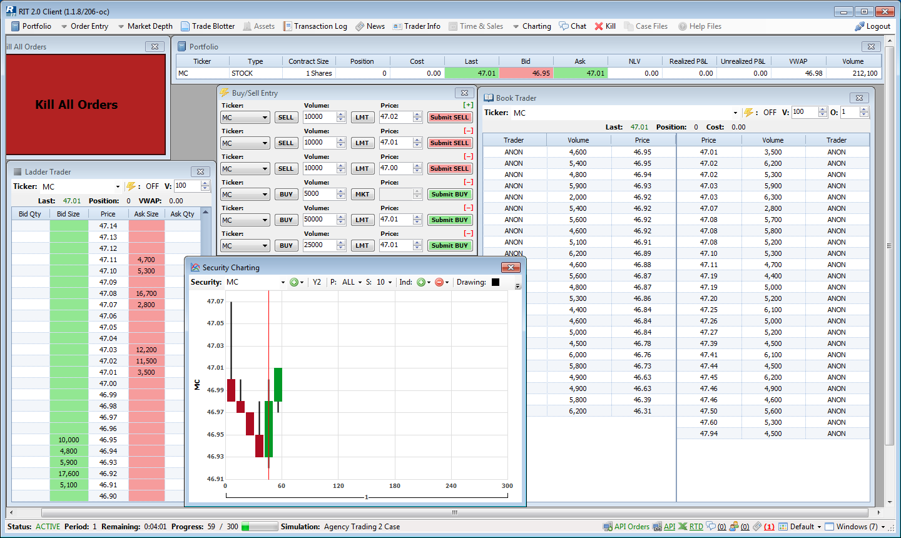

ritpytrading
============

RIT-trading-python
------------------

|PyPI pyversions| |Build Status| |Updates| |PyPI version fury.io|

|Python 3| |Codacy Badge| |License|

Python trading module for the Rotman Interactive Trader trading
software. `PyPI`_ page.

Full documentation available here.

Prerequisites
-------------

Python version 3

The Rotman Interactive Trading Client which can only be operated in a
**Windows system**. However, development of the PyPI ritpytrading package 
can be in done in Linux/BSD envrionment as well.

The full documentation for the Rotman Interactive Trader Client REST API
can be found at
`Swaggerhub <https://app.swaggerhub.com/apis/306w/rit-client-api/1.0.0>`_. The
documentation is also present in a JSON format in the
swagger_client_generated folder.

Installing
----------

RIT Client Software
~~~~~~~~~~~~~~~~~~~

The RIT Client for Windows system can be downloaded at
http://rit.rotman.utoronto.ca/software.asp.

Instructions for setting up an RIT demonstration client account for the
Liability Trading 3 case file can be found at RIT’s website at
http://rit.rotman.utoronto.ca/demo.asp.

Virtual environment packages with ``virtualenv`` or ``anaconda`` should
be used for both Windows and Linux/BSD based systems.

Windows
~~~~~~~

Initialize the repository with git.
Detailed instructions to download git for windows can be found at `atlassian <https://www.atlassian.com/git/tutorials/install-git#windows>`_.  The repository can then be initialized with git using:

::

   $ git clone https://github.com/SamSamhuns/RIT-trading-python

Two options are available after this:

-  Anaconda is recommended for Windows system. Set up up a virtual conda environment first.
   Then open the anaconda prompt and use the command ``conda install --yes --file requirements.txt``
   to install all modules from requirements.txt. 

-  Or Install \ ``python``\  and add it to your ``PATH`` system variable.
   Then install the \ ``pip``\  package if not installed already also adding it to the ``PATH`` system variable.
   Then run the following commands.

::

   $ pip install virtualenv
   $ virtualenv venv
   $ venv\Scripts\activate
   $ pip install -r requirements.txt

Linux/BSD
~~~~~~~~~

After cloning the repository, install the required python packages using
pip.

::

   $ git clone https://github.com/SamSamhuns/RIT-trading-python
   $ pip install virtualenv
   $ virtualenv venv
   $ source venv/bin/activate
   $ pip install -r requirements.txt

Building dists and running tests using makefile
---------------------------------------------

For **Windows**, different options are available for using makefile. `GnuWin's make`_
provides a native port for Windows (without requiring a full runtime environment like Cygwin).
After installing GnuWin, add ``C:\Program Files (x86)\GnuWin32\bin`` 
to your system ``PATH`` variable to run makefiles from any directory. 

-  For **Windows**, run makefile commands with ``make -f Makefile.win <directive>``. Example ``make -f Makefile.win help``
-  For **Linux/BSD**, run makefile commands with ``make <drective>``. 

Run the following command to get a list of all Makefile command options.

::

  $ make help

To run tests

::

  $ make test
  $ make test-all

To ensure the README.rst will be rendered in PyPI [might be outdated. Check twine check below]

::

  $ python setup.py check --restructuredtext
  
To report any problems rendering your README. If your markup renders fine, the command will output Checking distribution FILENAME: Passed. To run the check on sdist and wheel.

::

  $ twine check dist/*

To build the source and wheel package.
::
    
  $ make build

Running tests with the python unittest module
---------------------------------------------

Once python has been added to the ``PATH`` system variable in Windows,
the code for running the scripts on Windows and Linux/BSD based systems
are the same.

From the main directory, run:

::

   $ python -m unittest

If no tests are run from the command above, run the verbose mode.

Verbose mode

::

   $ python -m unittest discover -v

Usage (Only on Windows)
---------------------------------------------

**IMPORTANT:** The RIT Trading client must also be running to make sure the REST RIT API Client requests can be made.
In each script your **RIT Client API key** must be entered and the **requests** module be imported to make API calls.

To test out the ritpytrading package, install using pip inside a virtual environment:

::

   $ pip install ritpytrading

Examples scripts are present inside the ``examples`` folder. Documentation for usage available `here.  <https://samsamhuns.github.io/docs/html/index.html>`_

Built With
----------

-  `Python 3 <https://www.python.org/downloads/release/python-360/>`__
   - The Programming tool used

Versioning
----------

Version tracked with Git

Authors
-------

-  **Samridha Shrestha**

License
-------

This project is licensed under the Apahce 2.0 License - see the
`LICENSE.md <LICENSE.md>`__ file for details

Acknowledgments
---------------

-  Rotman School of Manangement, University of Toronto
   http://www.rotman.utoronto.ca/
-  Rotman Interactive Trader http://rit.rotman.utoronto.ca/
-  Python open source libraries
-  Joel Hasbrouck, NYU Stern Principles of Securities Trading,
   FINC-UB.0049, Spring 201. http://people.stern.nyu.edu/jhasbrou/
-  This project directory was created based on Cookiecutter_ and
   the `audreyr/cookiecutter-pypackage`_ project template.
-  README conversion for PyPI. `Pandoc.org`_.

Contributions
-------------

|contributions welcome|

Disclaimer
----------

All RIT software and external RIT links are provided by the Rotman
School of Management and are their exclusive property.

.. |Build Status| image:: https://travis-ci.org/SamSamhuns/ritpytrading.svg?branch=master
   :target: https://travis-ci.org/SamSamhuns/ritpytrading
.. |Updates| image:: https://pyup.io/repos/github/SamSamhuns/ritpytrading/shield.svg
   :target: https://pyup.io/repos/github/SamSamhuns/ritpytrading/
.. |Python 3| image:: https://pyup.io/repos/github/SamSamhuns/ritpytrading/python-3-shield.svg
   :target: https://pyup.io/repos/github/SamSamhuns/ritpytrading/
.. |Codacy Badge| image:: https://api.codacy.com/project/badge/Grade/5412099a50854132801b34e4e65bb327
   :target: https://www.codacy.com/app/samhunsadamant/RIT-trading-python?utm_source=github.com&utm_medium=referral&utm_content=SamSamhuns/RIT-trading-python&utm_campaign=Badge_Grade
.. |License| image:: https://img.shields.io/badge/License-Apache%202.0-blue.svg
   :target: https://opensource.org/licenses/Apache-2.0
.. |contributions welcome| image:: https://img.shields.io/badge/contributions-welcome-brightgreen.svg?style=flat
   :target: https://github.com/SamSamhuns
.. |PyPI pyversions| image:: https://img.shields.io/pypi/pyversions/ritpytrading.svg
   :target: https://pypi.python.org/pypi/ritpytrading/
.. |PyPI version fury.io| image:: https://badge.fury.io/py/ritpytrading.svg
   :target: https://pypi.python.org/pypi/ritpytrading/
.. _Cookiecutter: https://github.com/audreyr/cookiecutter
.. _`audreyr/cookiecutter-pypackage`: https://github.com/audreyr/cookiecutter-pypackage
.. _`Pandoc.org`: https://pandoc.org/
.. _`PyPI`: https://pypi.org/project/ritpytrading/
.. _`GnuWin's make`:  http://gnuwin32.sourceforge.net/packages/make.htm
